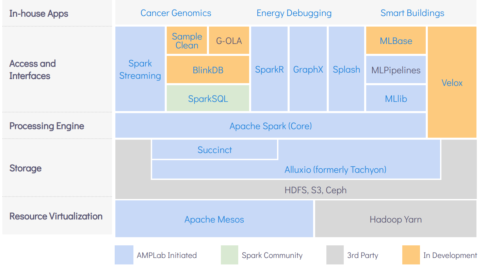

# Spark-SourceCode-Analysis
Apache Spark Notebook   
Author: Qizhuanhongjun

**Spark简介**  

Spark起源自科研院所，加州大学伯克利分校`UC Berkeley`的AMP实验室。该校在edx上开设了系列课程 :) ”The Data Science and Engineering with Spark XSeries“。  

08、09年起，一说到大数据，大家就想到Hadoop。但是这两年，Spark迅猛发展。  
Spark属于Hadoop生态圈的一环。Spark是一种计算框架，16年开始爆发，现在已经基本取代了Hadoop中的Map Reduce。  
 
- `计算框架`： Spark是一种计算框架，没有资源调度、数据存储等功能。需要和生态圈内的其它框架配合使用。
- `内存计算`： Hadoop中原生的Map Reduce是基于磁盘的，对于需要反复迭代的算法，中间结果反复导出导入磁盘，产生大量的I/O和序列化/反序列化开销。而Spark的核心Spark Core在内存中计算，具有性能优势。  
- 通用性： 可满足不同的业务场景需求。传统的交互式查询、流处理、批处理需要基于不同的框架进行处理，会形成数据孤岛，学习和维护的成本很高。Spark支持Spark Sql、Spark Streaming、GraphX等，一种框架满足多种需求。

Spark不是一种简单的Map Reduce替代，还具有很多优势。例如：编程范式相比Map Reduce更丰富，RDD+DAG的优势，等等。后续一步步涉及。 

**Spark生态圈**

以Spark Core为核心，UC Berkeley提出了大一统的软件栈，[BDAS架构](https://amplab.cs.berkeley.edu/software/) (the Berkeley Data Analytics Stack)。 

**Spark的编程语言**

Spark的源代码由`Scala`写成。对外支持API接口，可使用Scala、Java、Python和R编程，目前也有.Net版本。可以通过Spark Shell交互式编程。  

